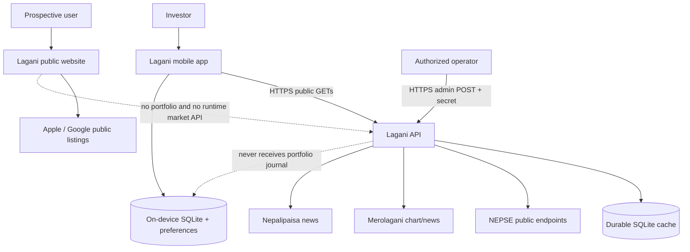
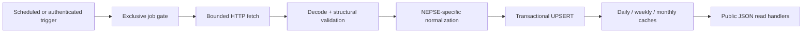
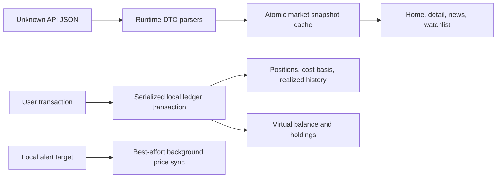
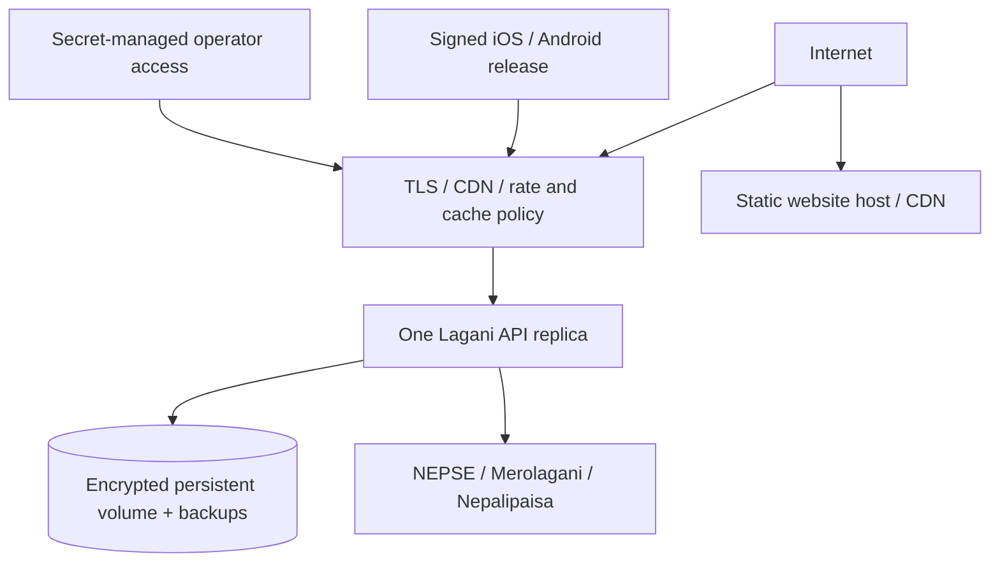

# Lagani system architecture

## 1. Goals and constraints

Lagani is a decision-support and learning system for NEPSE investors. It must make fragmented Nepal market information easier to follow without pretending to be an exchange feed, broker, custodian, or adviser. The architecture therefore optimizes for explainable data provenance, graceful stale/offline behavior, local portfolio privacy, low operational complexity, and safe iteration by a small founding team.

The current scale assumption is one production API replica with one durable SQLite volume. That is a deliberate first-release architecture, not an accidental claim of horizontal scalability.

## 2. System context

Trust boundaries:

- upstream source responses are untrusted external input and must be authenticated where required, size-bounded, decoded, normalized, and validated before persistence;
- public API consumers are untrusted and receive read-only cached data through validated parameters;
- admin triggers are privileged and secret-authenticated but do not accept arbitrary source URLs or payloads;
- the mobile database contains user-entered financial records and stays outside the backend trust boundary; and
- website build configuration is public by definition and cannot hold secrets.

## 3. Component responsibilities

### 3.1 API (`lagani_api`)

The API owns public-source ingestion and normalized cache delivery. At startup it opens SQLite, applies migrations, builds repositories/scrapers, registers HTTP routes, optionally registers Kathmandu-time cron jobs, optionally queues bootstrap jobs, and serves until graceful shutdown.

Data pipeline:

Important source behaviors:

- NEPSE requires a prove/authentication exchange and a challenge-derived request body for protected graph data.
- Price rows can omit previous close; when percent change is valid, the importer derives previous close as `ltp / (1 + percent/100)` and change as `ltp - previousClose`.
- Adjusted Merolagani series can contain impossible negative rows and high/low values that do not bound open/close. Invalid rows are skipped; otherwise bounds are expanded without changing open/close.
- Weekly aggregation starts Sunday, matching the Nepal trading week, rather than the ISO Monday convention.
- Mover snapshots are replaced as ranked sets so yesterday's entries do not leak into today's list.
- Company rows use UPSERT, not SQLite `REPLACE`, to avoid cascading deletion of dependent price/chart history.

The API serves cached data only. Source/network failure does not erase last-known data. Freshness is represented by each DTO's update/source time and response cache policy.

### 3.2 Mobile (`lagani`)

The mobile app owns the investor's personal state and presentation. Its boundary layers are:

The app validates unknown JSON before it reaches SQLite/UI. A full market refresh is a single logical snapshot, preventing mixed old/new company-price-mover state. Local write operations are serialized, and buys/sells update cash, quantities, cost basis, and transaction history atomically.

The paper-trading model is educational. It intentionally does not simulate order books, fees, taxes, settlement, corporate actions, liquidity, or every NEPSE rule. Manual holdings use moving-average cost accounting; selling reduces quantity and cost basis proportionally.

Expo Continuous Native Generation owns `ios/` and `android/` output. There is no custom native source in the repository; EAS/prebuild generates native projects from `app.json` and plugins.

### 3.3 Website (`lagani_website`)

The website owns public product explanation, legal routes, canonical metadata, and store links. All pages are generated statically at build time. It does not call the API, display live quotes, accept forms, or load analytics. Store links are emitted only for syntactically valid configured destinations; otherwise the user sees a disabled release state.

This separation prevents an API outage or stale quote from breaking or misleading the public marketing surface.

## 4. Data ownership and lifecycle

| Data class | System of record | Retention/lifecycle | Sent to Lagani backend? |
| --- | --- | --- | --- |
| Companies, prices, status, movers | API SQLite cache, sourced externally | Refreshed by schedule; last-known rows retained | Public source data only |
| Daily/weekly/monthly charts | API SQLite cache | Upserted by symbol/timestamp and regenerated aggregates | Public source data only |
| News metadata/links | API SQLite cache | Source-deduplicated and ordered by publication time | Public source data only |
| Portfolio transactions/positions | Mobile SQLite | Until user resets/uninstalls; schema-migrated locally | No |
| Paper trades/balance/holdings | Mobile SQLite | Until user resets/uninstalls | No |
| Watchlist and alert targets | Mobile SQLite/preferences | Until user changes/resets | No |
| App market cache | Mobile SQLite | Replaced on successful snapshot refresh | Derived from public API |
| Website content/config | Git + immutable build | Versioned per deployment | Public only |
| API request logs | Production platform | Must have an operator-defined retention policy | Technical metadata only |

The privacy boundary changes if accounts, sync, analytics, crash reports, ads, newsletters, or support forms are added. Such a change requires a new data-flow review, user controls, retention/deletion design, legal updates, threat model, migration, and tests.

## 5. Time, calendar, and freshness model

- Scheduler and NEPSE business-hour decisions use `Asia/Kathmandu`.
- Scheduled trading jobs assume Sunday through Thursday and are staggered to reduce bursts.
- Stored/public ordinary timestamps are UTC and serialized as RFC 3339.
- Chart candle timestamps are Unix seconds in UTC.
- Weekly candles align to Sunday; monthly candles align to the first calendar day.
- `market_status.asOf` is the source time when available; `updatedAt` is ingestion time.
- Closing snapshots run after market close so a closed session retains the final available day state.
- The app can display cached values outside trading hours, but must show freshness/status and never silently label them live.
- Local portfolio valuations are estimates using the latest cached price; a missing valid quote is not replaced by a fabricated trade price.

See [docs/API_CONTRACT.md](./docs/API_CONTRACT.md) for field-level semantics.

## 6. Availability and consistency

The system favors available last-known market context over erasing data on source failure. It does not favor silently mixing inconsistent snapshots.

| Scenario | API behavior | Mobile behavior | Website behavior |
| --- | --- | --- | --- |
| Upstream temporarily fails | Job logs failure; existing cache remains | Uses last local cache and reports refresh failure | Unaffected |
| API offline | Health monitoring fails | Existing local market/portfolio data remains usable; refresh-dependent functions fail visibly | Unaffected |
| Fresh DB before ingestion | Collection endpoints return `[]`; status is 404 | Empty/onboarding/error states, not fake market values | Unaffected |
| One market endpoint returns invalid JSON | API should never emit it; parser rejects if it occurs | Whole full refresh is not committed | Unaffected |
| Duplicate ingestion trigger | Job gate returns 409 | No admin access exists in app | No admin access exists in site |
| App terminates during local trade | SQLite transaction rolls back or commits atomically | Ledger remains consistent | Not applicable |
| Store listing absent | Not applicable | Not applicable | Non-interactive “Coming soon” badge |

SQLite is configured for foreign keys, WAL, busy timeout, and one pooled connection. The in-process exclusive job gates complement—not replace—database correctness.

## 7. Security architecture

### API

- Public routes are read-only and validate all path/query input.
- Admin routes fail closed when no key is configured and compare secrets in constant time.
- Admin refreshes do not accept arbitrary URLs or code.
- CORS is an explicit browser-origin allowlist with no credentialed requests. Native apps do not use browser CORS.
- Responses use request IDs, panic recovery, handler timeouts, safe errors, cache policy, and basic security headers.
- Container runs unprivileged with only the API binary, Wasmer library/module, CA roots, timezone data, and writable `/data` volume.
- Production secrets belong in a secret manager and TLS terminates at a trusted edge.

### Mobile

- No API admin secret, broker credential, or signing key is in source/application configuration.
- Runtime API URLs allow only HTTP(S); production must be HTTPS.
- Unknown JSON is validated before persistence.
- Financial state is local; device backup/encryption behavior must be reflected in store/privacy disclosures.
- External news links are untrusted destinations and opened through system browser controls.
- Notification delivery is best effort and not a risk-control mechanism.

### Website

- No user input, account, API secret, third-party script, or runtime market request.
- CSP restricts execution/resources to self and disables objects/frames/arbitrary connections.
- Security headers deny framing, MIME sniffing, unnecessary device permissions, and excess referrer leakage.
- Container runs unprivileged; public variables are validated and embedded at build time.

## 8. Deployment topology

First-release production topology:

The website and API should use separate origins, for example `lagani.example` and `api.lagani.example`. The mobile `EXPO_PUBLIC_API_URL` is the API origin. Do not make the website proxy the API merely to share a domain.

The API's Wasmer-Go dependency currently constrains the supplied container to Linux AMD64. A native ARM64 production target requires replacing/upgrading that authentication runtime or providing a tested ARM64 linker/runtime path.

## 9. Scaling path

Do not add replicas to the current API with independent SQLite files. That would create divergent caches and duplicate schedules. Scale in ordered stages:

1. instrument request/source-job latency, failures, cache freshness, and data volume;
2. isolate scheduling so exactly one elected worker runs ingestion;
3. move cache state to a shared managed relational database if multiple API replicas are actually needed;
4. add schema migration ownership and transaction/isolation tests;
5. put stateless read replicas behind the edge;
6. evaluate a queue for long all-company backfills only after measured job contention; and
7. keep source-specific rate/backoff policy regardless of scale.

The mobile and static site already scale independently: mobile work runs on devices, and site assets can be globally cached.

## 10. Architectural decisions

| Decision | Rationale | Revisit when |
| --- | --- | --- |
| One root Git repository | Contracts and cross-layer changes version atomically | Teams/releases truly require independent history |
| Go API + SQLite | Small operational surface and sufficient first-release write model | Measured availability/throughput requires replicas |
| In-process scheduler | Simple single-leader ingestion | Multiple replicas or independent job scaling is required |
| Local-first personal finance data | Privacy, offline utility, no account infrastructure | Users explicitly need sync/backup/multi-device |
| Runtime DTO validation in app | Network JSON is untrusted and TypeScript types do not exist at runtime | A generated schema client fully replaces it |
| Expo CNG | No custom native code; reproducible managed upgrades | Required native customization cannot be expressed by plugins |
| Static marketing website | High availability, low attack surface, no fake ticker | A justified dynamic public feature is approved |
| No shared frontend package yet | Only one application consumes API DTOs; avoids premature monorepo tooling | Web/mobile both consume stable generated contracts |

## 11. Change impact checklist

A market DTO change must update Go models/handlers/repository tests, the contract document, mobile runtime parser/types/fixtures, UI empty/error/freshness behavior, and any legal/marketing claim affected. Release API compatibility before or alongside the app; do not remove a field required by the current store version.

A source change must update source permission review, timeouts/size bounds, validation/normalization fixtures, live canary, provenance/freshness semantics, scheduler load, and audit docs.

A portfolio/cloud change must update threat/privacy architecture before implementation. A website tracking/form change must update CSP and legal/provider inventory before deployment.
