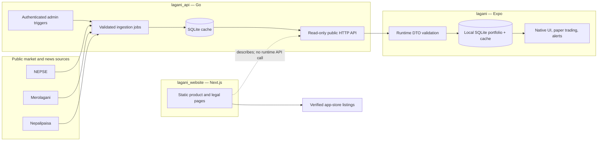

# Lagani

Lagani is a three-deployable system for Nepal's investing community:

1. `lagani_api` collects and normalizes NEPSE company, status, price, mover, historical, chart, and Nepal market-news data.
2. `lagani` is the Expo mobile app for local portfolio accounting, paper trading, watchlists, price alerts, charts, and news.
3. `lagani_website` is the public product/legal website and store-download surface.

This repository was audited end to end in August 2026. The API and clients were repaired, their deployment paths were made reproducible, tests and CI were added, and each directory now contains detailed architecture, audit, test, and release documentation. The code is ready for a controlled staging deployment. Public launch still requires founder-owned production values, legal review, hosting, data-source permission decisions, and real device/store validation; those gates are listed below and in [DEPLOYMENT.md](./DEPLOYMENT.md).

## System at a glance



The crucial boundary is that the API publishes cached market information but never receives a user's portfolio. Portfolio transactions, paper trades, watchlists, and alert targets stay in the mobile app's local SQLite database. The marketing website has no runtime API dependency.

## Repository map

| Path | Role | Primary stack | Detailed entry point |
| --- | --- | --- | --- |
| [`lagani_api/`](./lagani_api) | Data ingestion, normalization, cache, public/admin API | Go 1.23, Chi, SQLite, cron, Wasmer | [`lagani_api/README.md`](./lagani_api/README.md) |
| [`lagani/`](./lagani) | iOS/Android app and optional Expo web preview | Expo 57, React Native 0.86, TypeScript, SQLite | [`lagani/README.md`](./lagani/README.md) |
| [`lagani_website/`](./lagani_website) | Static public marketing/legal site | Next.js 16, React 19, TypeScript | [`lagani_website/README.md`](./lagani_website/README.md) |
| [`.github/workflows/`](./.github/workflows) | Component-scoped CI for all three deployables | GitHub Actions | component testing docs |
| [`compose.yaml`](./compose.yaml) | Local/staging API + website topology | Docker Compose | [`DEPLOYMENT.md`](./DEPLOYMENT.md) |
| [`docs/API_CONTRACT.md`](./docs/API_CONTRACT.md) | Mobile-to-API contract and freshness semantics | JSON/HTTP | contract reference |

There is one Git repository at this root. The subdirectories are components, not nested repositories. Keep commits scoped by component when possible, but version cross-contract changes together.

## Quick verification

Install locked dependencies once:

```bash
cd lagani && npm ci
cd ../lagani_website && npm ci
cd ..
```

Then run the deterministic repository suite:

```bash
make verify
```

It performs:

- API race-enabled unit/integration tests and `go vet`;
- mobile strict TypeScript, nine Vitest cases, and 20/20 Expo Doctor checks; and
- website ESLint, strict TypeScript, static production generation, and generated-HTML smoke assertions.

Platform bundles and live upstream sources are deliberately separate:

```bash
cd lagani
npx expo export --platform android --output-dir /tmp/lagani-android
npx expo export --platform ios --output-dir /tmp/lagani-ios

cd ../lagani_api
make test-live
```

Live source tests contact production third parties and should be used as a scheduled canary or an intentional pre-release check, not on every pull request.

## Local API and website containers

```bash
cp .env.example .env
docker compose config --quiet
docker compose up --build
```

Defaults expose the API on `http://localhost:8080` and the website on `http://localhost:3000`. Scheduler and startup jobs are disabled by default so merely starting the stack does not scrape third-party sources. With a fresh volume, public collection endpoints are therefore empty until ingestion is intentionally enabled or an authenticated admin refresh is triggered.

For the Expo app on a simulator/device:

```bash
cd lagani
cp .env.example .env
# Set EXPO_PUBLIC_API_URL to an address the target device can reach.
npm start
```

`localhost` means the device itself. Use the host machine's LAN address for a physical phone and the documented emulator mapping where applicable.

## Current verification record

The final audit pass established:

- API: all Go tests, `go vet`, and `go test -race ./...` pass; Linux production container smoke passed; live NEPSE companies/status/prices/movers/history and both news sources returned usable data.
- Chart regression: live NABIL returned 225 daily points; live NMB50 returned 1,289 usable points after the importer rejected 69 corrupt provider candles and normalized five adjusted-bound inconsistencies.
- Mobile: strict TypeScript, 9/9 tests, Expo Doctor 20/20, Android export, and iOS export pass.
- Mobile workflows: live API data, stock details/charts, watchlist persistence, news, paper buy/sell, manual portfolio cost accounting, settings, and help were exercised at a phone viewport.
- Website: lint, typecheck, static build, release-state assertions, production/full dependency audits, unprivileged container smoke, security headers, legal routes, 404, 1440-pixel desktop, and 390-pixel phone checks pass with no console errors or horizontal overflow.
- CI: component path filters and locked toolchains exist for API, mobile, and website.

See [AUDIT.md](./AUDIT.md) for evidence, original risks, and residual gates.

## Non-negotiable product rules

- Never describe cached/scraped prices as a guaranteed real-time exchange feed.
- Never use Lagani data, charts, alerts, or simulations as a substitute for a broker or authoritative NEPSE record.
- Never embed `ADMIN_API_KEY` in the mobile app or website.
- Never collect or upload the local portfolio journal without an explicit product, privacy, security, and migration design.
- Keep API timestamps in UTC/RFC 3339, chart timestamps in Unix UTC seconds, and scheduler/business-calendar logic in `Asia/Kathmandu` with Sunday–Thursday trading assumptions.
- Preserve last-known market data outside trading hours and show its source/update time; do not replace a closed-market snapshot with fabricated zeros.
- Keep admin ingestion jobs mutually exclusive and SQLite deployment single-writer/single-replica until the persistence architecture is deliberately changed.
- A missing store URL must remain a truthful non-interactive “Coming soon” state.

## Launch gates outside the codebase

Before public release, the founders must supply or approve:

1. a production HTTPS API origin and persistent encrypted storage/backup destination;
2. a strong API admin secret in a secret manager;
3. monitoring, alerts, log retention, incident ownership, and source-ingestion canaries;
4. confirmation that the intended use of NEPSE, Merolagani, Nepalipaisa, and linked news content is permitted;
5. qualified Nepal-specific privacy, financial-disclaimer, consumer, entity, and terms review;
6. final Apple/Google signing ownership, bundle/listing details, privacy disclosures, and physical-device testing;
7. a canonical website domain, monitored public support/privacy mailbox, and verified public store URLs;
8. refreshed marketing screenshots from the actual release build; and
9. a compatible Expo/Metro update for the remaining build-time `image-size` advisory, or a formally accepted and time-bounded risk decision while builds accept only trusted assets.

These gates are visible on purpose. “The tests pass” is necessary, but it is not sufficient proof that a market-data product is legally and operationally ready for the public.

## Documentation index

- [ARCHITECTURE.md](./ARCHITECTURE.md) — whole-system boundaries, flows, decisions, security, and scaling
- [AUDIT.md](./AUDIT.md) — consolidated risk and remediation report
- [DEPLOYMENT.md](./DEPLOYMENT.md) — ordered staging/production and rollback runbook
- [TESTING.md](./TESTING.md) — deterministic, live-source, device, browser, and acceptance matrices
- [docs/API_CONTRACT.md](./docs/API_CONTRACT.md) — exact API/client data contract and freshness rules
- component `README.md`, `ARCHITECTURE.md`/`how_it_works.md`, `AUDIT.md`, `DEPLOYMENT.md`, and `TESTING.md` files — implementation-level detail
