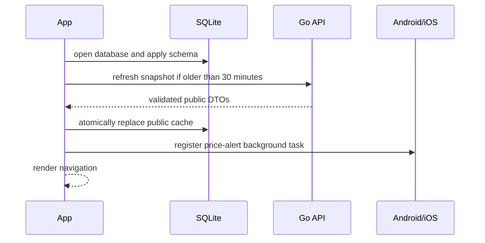

# Mobile architecture

## Responsibilities and trust boundaries

The mobile app has two data planes:

1. **Public market cache.** Companies, current prices, movers, market status, and news are fetched from the public Go API. The JSON is untrusted until `src/domain/marketData.ts` validates every record. A complete snapshot is then replaced atomically in SQLite.
2. **Personal device data.** Watchlist entries, manual portfolio transactions, alerts, paper cash, paper positions, and paper history exist only in the app's SQLite database. There is no account system or cloud synchronization in this version.

The client is not allowed to call upstream market sources or backend admin endpoints. This keeps NEPSE challenge logic, scraper churn, schedules, and admin credentials out of distributable app bundles.

## Startup sequence

Database initialization is a hard dependency and has a retry UI. Network refresh is soft: if it fails, an existing cache remains usable. First launch with no cache and an unreachable API produces explicit empty/error states rather than invented data.

On native platforms the database may be opened synchronously before the task manager is registered. On web it is opened asynchronously because Expo SQLite Web runs through a worker and synchronous startup can deadlock when `SharedArrayBuffer` is unavailable.

## Public data refresh

`refreshAllData()` requests companies, prices, gainers, losers, market status, and news concurrently. Runtime parsers reject malformed response shapes, invalid numeric fields, invalid dates, mismatched mover types, and malformed chart points.

The app does not clear a good cache endpoint-by-endpoint. It waits for the complete snapshot and commits the replacement in one serialized SQLite transaction. Empty company or price results are rejected as incomplete. Pull-to-refresh forces a refresh; normal focus/startup refreshes at most every 30 minutes. Concurrent full or price-only refreshes share an in-flight promise.

News can refresh independently. Price-alert checks use a price-only refresh so the comparison is not made against a knowingly stale device cache.

## SQLite ownership

### Public cache tables

| Table | Primary key | Source | Replacement behavior |
| --- | --- | --- | --- |
| `Companies` | `securityId`; unique `symbol` | `/companies` | Full snapshot |
| `Prices` | `symbol` | `/prices` | Full price list |
| `TopGainers` | `rank`; unique `symbol` | `/top-gainers` | Full list |
| `TopLosers` | `rank`; unique `symbol` | `/top-losers` | Full list |
| `MarketStatus` | fixed row `id=1` | `/market-status` | Single row |
| `NewsItems` | backend ID; unique `link` | `/news` | Full recent list |

Cache schema version 2 rebuilds only public tables and preserves the old watchlist during migration.

### Personal tables

| Table | Purpose | Important invariant |
| --- | --- | --- |
| `Watchlist` | User-selected symbols | Symbol is normalized uppercase and unique. |
| `PortfolioTransactions` | Immutable-style BUY/SELL ledger, with supported edits/deletes | Quantity is a positive whole number and price is positive. |
| `PortfolioHoldings` | Derived current manual positions | Recomputed inside the same transaction as a ledger mutation. |
| `PriceAlerts` | Local ABOVE/BELOW targets | Only active rows are evaluated; a fired alert is deactivated. |
| `PaperTradingAccount` | Fixed row holding virtual cash | Balance cannot become negative through `executePaperTrade`. |
| `PaperTradingTransactions` | Paper order history | Written atomically with cash and position changes. |
| `PaperTradingPortfolio` | Current paper positions | No negative position; average cost is preserved on sells. |
| `PaperPortfolioHistory` | Cash plus marked-to-market positions | Values are stored chronologically after focus, refresh, and trades. |

SQLite writes pass through one promise queue and use transactions. WAL, foreign keys, and a busy timeout are enabled. This avoids overlapping screen refreshes or background tasks interleaving multi-statement updates.

## Portfolio accounting

Manual holdings use a chronological moving-average ledger:

- BUY: `new average = (old quantity × old average + buy quantity × buy price) / new quantity`
- SELL: quantity decreases and average cost stays unchanged.
- A sell that exceeds the position at that point in the ledger is rejected.
- Editing or deleting any transaction replays the full symbol ledger inside the surrounding transaction.
- A zero position removes the derived holding row.

The UI values the remaining quantity at the most recent cached LTP. Manual transaction prices do not include brokerage, SEBON fees, DP charges, capital-gains tax, or Nepal's settlement rules; therefore this is portfolio tracking, not a broker or tax ledger.

Paper trades use a separate atomic path. A BUY debits virtual cash and updates weighted average cost. A SELL validates the held quantity, credits cash, and preserves average cost on remaining shares. The starting balance is Rs. 1,000,000.

## Charts

Stock charts are requested directly from `/charts/{symbol}` and are not copied into device SQLite. The selected range is encoded as a query parameter, response points are validated, and the screen distinguishes loading, error, empty, and populated states.

Both stock and paper charts use `react-native-svg`; they do not load chart JavaScript from a CDN and do not inject remote code into a WebView. The chart component supports touch selection, flat series, one-point series, and deterministic axis bounds.

## Price alerts

The task named `lagani-price-alerts` is defined at module scope as required by Expo Task Manager. In a standalone native build it:

1. initializes the schema;
2. refreshes current prices;
3. loads active alerts and relevant prices;
4. evaluates pure ABOVE/BELOW rules;
5. schedules a local notification; and
6. deactivates each fired alert.

The configured 15-minute interval is a minimum request, not a schedule. Android and iOS can defer or suppress execution. Web does not register background checks. This feature must always be described as best-effort.

## Navigation

The root native stack owns full-screen routes such as Help and transaction history. Its primary child is a six-tab navigator. Home is itself a stack so Home and Stock Detail keep the tab bar. Cross-tab stock links target `HomeStack -> StockDetail` explicitly.

## Security and privacy

- Only `http` and `https` API base URLs parse; production must use HTTPS.
- News articles must start with HTTPS, and WebView navigation is restricted to HTTPS.
- No backend admin key or market-source token is present in the client.
- All personal data is on-device and can be reset from Settings.
- There is currently no encryption beyond platform/application sandbox storage and no cross-device backup contract.
- Console errors intentionally omit response bodies beyond the API client's short error excerpt.

## Expected failure behavior

| Failure | Behavior |
| --- | --- |
| API unavailable with existing cache | Screens keep using cache and surface refresh errors. |
| API unavailable on first launch | Initialization completes; market screens show empty/error states. |
| Invalid API DTO | Parser rejects the refresh and leaves the prior snapshot intact. |
| Empty prices or companies | Full replacement is refused. |
| Invalid portfolio sale | Entire ledger mutation rolls back. |
| Invalid/insufficient paper order | Cash, history, and positions remain unchanged. |
| Missing OHLC source values | UI displays `--`; it does not label zero as a real statistic. |
| Missing chart history | Stock screen shows a range-specific empty state. |
| Background tasks unavailable | App remains usable; warning is logged and alerts remain best-effort. |

