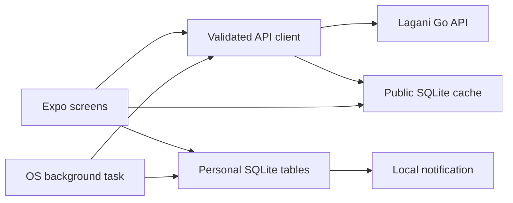

# Lagani mobile app

Lagani is the Expo/React Native client for the Lagani Nepal investing platform. It reads public market data from the Go service in `../lagani_api`, caches a validated snapshot on the device, and keeps portfolio, watchlist, alert, and paper-trading data local to that installation.

The app is an information and education tool. It does not submit orders, hold funds, provide tax accounting, or provide investment advice. It is not affiliated with NEPSE.

## Current implementation

- Live market status, current prices, top gainers, top losers, and company search.
- Real historical stock charts from the backend chart endpoint.
- Local watchlist with current price and daily percentage movement.
- Manual portfolio ledger with BUY/SELL validation, moving-average cost, current value, and unrealized P/L.
- Atomic paper trades backed by SQLite, starting with Rs. 1,000,000 virtual cash.
- Paper cash, positions, transaction history, and marked-to-market equity history.
- News from Merolagani and Nepalipaisa through the backend cache, with HTTPS-only article navigation.
- Local price alerts and best-effort background notification checks in standalone native builds.
- Explicit loading, empty, offline-cache, and retry states.

## Runtime architecture



The backend is the only component that communicates with NEPSE, Merolagani, and Nepalipaisa. The app never contains the NEPSE proof-token implementation or an admin API key. See [ARCHITECTURE.md](ARCHITECTURE.md) for data flows, table ownership, accounting rules, and failure behavior.

## Prerequisites

- Node.js 20.19 or newer.
- npm.
- A running Lagani API for local development, or its deployed HTTPS URL.
- Xcode for local iOS builds and Android Studio for local Android builds.
- An Expo account and EAS CLI for cloud builds.

## Local setup

1. Start the API using `../lagani_api/README.md`.
2. Install exactly the locked dependencies:

   ```sh
   npm ci
   ```

3. Create the local environment file:

   ```sh
   cp .env.example .env
   ```

4. Set `EXPO_PUBLIC_API_URL` to a URL reachable by the target device.

   - iOS simulator: `http://localhost:8080`
   - Android emulator: commonly `http://10.0.2.2:8080`
   - Physical device: use the development machine's LAN IP, for example `http://192.168.1.20:8080`
   - Production: the deployed HTTPS API origin

5. Start Expo:

   ```sh
   npm start
   ```

Expo Go is useful for ordinary UI development, but background execution and notification behavior must be verified in a standalone development or preview build.

## Required checks

Run the complete deterministic app gate before a merge or build:

```sh
npm run verify
```

It runs TypeScript checking, Vitest, and Expo Doctor. Native JavaScript bundles can be checked with:

```sh
npx expo export --platform android --output-dir dist/android
npx expo export --platform ios --output-dir dist/ios
```

See [TESTING.md](TESTING.md) for the live API and device test matrix.

## Configuration

| Variable | Required | Purpose |
| --- | --- | --- |
| `EXPO_PUBLIC_API_URL` | Yes | Base URL of the public Lagani API. It must not include a trailing endpoint path. |

`EXPO_PUBLIC_*` values are embedded in the client bundle. Never place secrets, admin keys, database credentials, or private upstream tokens in them.

Native identity is configured in `app.json`:

- iOS bundle identifier: `com.lagani.app`
- Android application ID: `com.lagani.app`

These identifiers must be confirmed against the founders' Apple and Google accounts before the first store release because changing them later creates a different app identity.

## Project map

```text
App.tsx                         initialization, background alerts, root providers
app/navigation/                root stack, bottom tabs, nested Home stack
app/screens/                   screen-level presentation and orchestration
app/components/                modals, cards, and native SVG charts
src/api/nepseScraper.ts        public API calls, timeout, refresh deduplication
src/domain/marketData.ts       runtime validation of untrusted JSON
src/domain/portfolio.ts        pure moving-average ledger rules
src/domain/priceAlerts.ts      pure alert-trigger rules
src/types/market.ts            backend response contracts
src/utils/database.ts          SQLite schema, migrations, transactions, queries
scripts/web-preview-proxy.mjs  COOP/COEP development proxy for Expo SQLite Web
```

`ios/` and `android/` are intentionally not committed. The project uses Expo Continuous Native Generation; native projects are generated from `app.json` and plugins for local builds or by EAS. Do not manually patch generated native files unless the project deliberately switches to a bare workflow.

## Documentation

- [ARCHITECTURE.md](ARCHITECTURE.md) — boundaries, data ownership, schemas, flows, and invariants.
- [AUDIT.md](AUDIT.md) — audit findings, repairs, remaining operational risks, and release gates.
- [DEPLOYMENT.md](DEPLOYMENT.md) — native build, signing, environment, rollout, and rollback runbook.
- [TESTING.md](TESTING.md) — automated and manual verification matrix.
- [TUTORIAL.md](TUTORIAL.md) — end-user feature guide mirrored by the in-app Help screen.
- [TASKS.md](TASKS.md) — follow-up backlog that is not required for the audited baseline.
