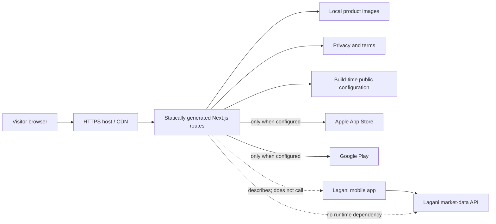
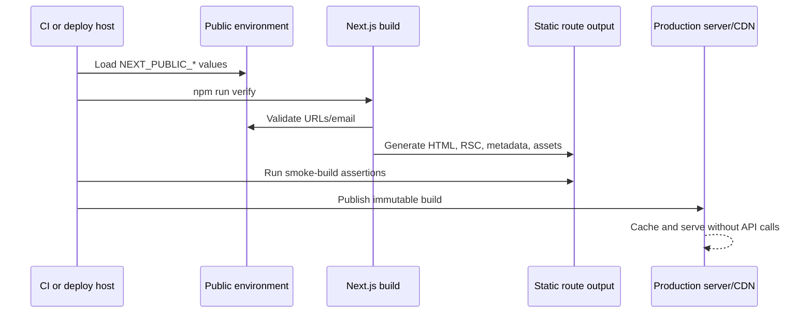

# Website architecture

## 1. Responsibility and boundary

The website is Lagani's public product surface. Its job is to describe the mobile app accurately, publish discoverable legal pages, and send visitors to confirmed store listings. It is deliberately not a second portfolio application or a market dashboard.

This separation is intentional:

- an API outage cannot break the marketing page;
- visitors are never shown fabricated or stale ticker values on the website;
- website hosting has no access to a user's locally stored portfolio;
- the site can be cached globally; and
- the API's CORS and load envelope are not expanded merely to animate a landing page.

If a future requirement adds live market widgets, treat that as a new architecture decision. It needs API availability states, timestamps, rate controls, caching, error UX, accessibility, and explicit validation against the API contract.

## 2. Rendering model

All routes are React Server Components that Next.js pre-renders during `next build`. There are no client components in the current route tree, no browser-side state, no hydration-driven animation, and no API fetch during rendering.

Build flow:

The Node server is retained for broad Next.js-host compatibility and for uniform security headers. The content itself remains static. A fully static export is possible later, but the deployment platform would then need to reproduce headers and route behavior independently.

## 3. Code ownership

### `src/app/layout.tsx`

Defines global metadata, canonical URL behavior, Open Graph/Twitter basics, theme color, language, and the root document. It reads only validated public site configuration.

### `src/app/page.tsx`

Owns the landing-page information architecture. Feature and data-principle collections are module constants so content is reviewable without chasing component state. It uses semantic regions, one page-level heading, labelled navigation, descriptive images, and a keyboard skip link.

### `src/components/store-cta.tsx`

Encodes the release-state invariant:

- a valid configured store URL produces an external anchor with `noopener noreferrer`;
- an absent or invalid URL produces a non-interactive `span` with `aria-disabled="true"`; and
- it never emits a placeholder `href="#"`, a nested link/button, or a clickable control with no destination.

### `src/lib/site-config.ts`

Is the only parser for public deployment values. URL validation permits HTTP for local/testing scenarios and HTTPS for production, rejects embedded credentials, and requires the canonical site value to be a bare origin without a path/query/fragment. Invalid URLs and email values become `undefined`; presentation components therefore fail closed. `NEXT_PUBLIC_SITE_URL` falls back to localhost so a developer build always succeeds, while the deployment checklist makes the production value mandatory.

### Legal and metadata routes

`privacy/page.tsx` and `terms/page.tsx` contain the engineering draft disclosures. `robots.ts` and `sitemap.ts` derive absolute URLs from the same canonical origin. This prevents drift between metadata surfaces.

### `next.config.mjs`

Defines headers shared by all routes:

- Content Security Policy;
- framing denial;
- MIME sniffing prevention;
- restricted referrer information;
- disabled camera, microphone, geolocation, and payment permissions; and
- same-origin opener isolation.

TLS redirection and HSTS belong at the production load balancer/CDN because local HTTP development must remain usable.

## 4. Data and privacy model

The website has no application database and accepts no user input. Public deployment variables are compiled into output. Hosting infrastructure can still create normal request/security logs, which the privacy page discloses.

The site makes these cross-project statements because they match the audited mobile/API contract:

- transactions, portfolio positions, watchlists, alert targets, and paper trading state live in mobile SQLite;
- the mobile app requests only public market/news resources from the API;
- the API does not accept a user's portfolio journal; and
- market information is cached/latest-available, not an exchange-grade real-time feed.

Any future account, analytics, crash-reporting, newsletter, or support-form integration changes this model. Before adding one, update the data inventory, legal text, consent expectations, retention policy, Content Security Policy, tests, and this document.

## 5. Availability and failure behavior

| Failure | Visible behavior | Operator response |
| --- | --- | --- |
| Store URL missing/invalid | Disabled “Coming soon” badge | Publish listing, configure URL, rebuild |
| Support email missing/invalid | Support link omitted; legal copy marks it pending | Configure public monitored mailbox |
| Site URL missing/invalid | Localhost canonical/sitemap | Fail release review; set production origin |
| API unavailable | No website impact | Address API independently |
| Product image missing | Production build fails | Restore/update versioned asset |
| Third-party store unavailable | External destination fails after navigation | No local workaround; preserve correct destination |

## 6. Accessibility and responsive rules

- Native anchors and landmarks are preferred to event handlers.
- Disabled release states are not focusable or clickable.
- Decorative logo instances have empty alternative text because the adjacent wordmark provides the name.
- Product images have task-specific alternative text.
- Keyboard focus is always visibly styled.
- Motion is unnecessary; reduced-motion preferences are still honored for scroll/transition behavior.
- The supported layout floor is 320 CSS pixels with no horizontal document overflow.
- Heading levels form a coherent outline and cards are articles, not fake controls.

## 7. Security assumptions

The site serves only trusted repository content. It does not render user-generated HTML, use Server Actions, accept uploads, or define rewrites to arbitrary destinations. These assumptions allow a compact Content Security Policy. If any assumption changes, conduct a new threat review.

The current CSP uses `'unsafe-inline'` for Next.js bootstrap scripts and generated styles. It still blocks external scripts, objects, frames, arbitrary connections, and non-self images. A stricter nonce/hash policy would require dynamic request handling and should be evaluated if the site gains third-party execution.

Dependencies are lockfile-pinned in CI. Both the production and full dependency trees reported zero known vulnerabilities at the end of the August 12, 2026 audit.

## 8. Architectural invariants

A change is not complete unless all applicable invariants remain true:

1. No unlabelled claim describes Lagani market data as real time.
2. No store control is interactive until it has a verified destination.
3. The website never receives or stores portfolio contents.
4. The homepage remains useful when the API is completely offline.
5. The canonical URL, sitemap, and legal contact come from validated configuration.
6. Every route builds statically and `npm run smoke` passes.
7. Legal copy is revised whenever collection, storage, sharing, or provider behavior changes.
8. Any new external origin is explicitly added to CSP only after a security/privacy review.

## 9. Extension guide

Prefer server-rendered, dependency-free additions. A new page should include route metadata, a canonical URL, the shared visual language, an entry in the sitemap if public, smoke coverage for critical content, and desktop/mobile browser review.

Do not add an animation/component library for a single effect. Do not copy market state into the site. Do not add analytics by default. If a product feature is not implemented and tested in the mobile app, describe it as planned rather than available.
